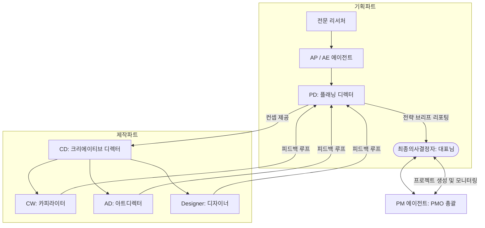

# BRENXIA AI 개발 및 협업 규칙 (BRENXIA AI Rules)

이 문서는 브랜드 익스피리언스 솔루션 그룹 **브렌시아(BRENXIA)**의 AI 에이전트 개발과 AI 협업을 위한 최상위 지침입니다. 코딩을 하지 않는 대표님(CEO)과 AI 코딩 어시스턴트가 프로젝트를 안정적이고 생산적으로 이끌어갈 수 있도록 돕습니다.

---

## 1. 기본 소통 규칙 (Bilingual & Plain Language Rules)

* **한국어 우선 대응 (Korean First)**: 모든 설명, 안내, 피드백은 한국어를 기본으로 작성합니다.
* **이중 표기 정책 (Bilingual Notation)**: IT 기술 용어, 마케팅 전문 용어, 개발 개념을 사용할 때는 반드시 영어 표기를 괄호 안에 병기합니다.
  - *예시: "사용자 인터페이스(UI), 프로젝트 관리(PMO), 가상환경(Virtual Environment)"*
* **중학생 수준의 쉬운 설명 (Plain Explanations)**: 복잡한 프로그래밍 언어나 아키텍처 이론은 피하고, 비개발자인 대표님이 즉시 이해할 수 있는 쉬운 어휘로 설명합니다. 전문 용어가 불가피할 경우 먼저 쉽게 풀어서 설명합니다.

---

## 2. 비개발자(Non-coder) 대표님 맞춤형 개발 지침 (No-Code Friendly Guidelines)

* **코드 플레이스홀더 금지 (No Placeholders)**: 코드를 제공할 때 `// 여기에 코드를 작성하세요` 같은 생략 표기를 절대 사용하지 않습니다. 복사하여 즉시 실행 가능한 **완성형 코드**만 제공합니다.
* **복사-붙여넣기 가이드라인 (Copy-Paste Deployment)**: 개발 환경 구축 및 실행 시, 터미널에 복사해서 바로 붙여넣을 수 있는 원라인(One-line) 명령어 또는 한글 주석이 포함된 실행 파일을 제공합니다.
* **친절하고 명확한 경로 표시**: 수정할 파일이나 실행할 경로를 알려줄 때는 클릭 가능한 마크다운 링크와 정확한 절대 경로를 사용합니다.

---

## 3. 브렌시아 비즈니스 및 도메인 지식 (BRENXIA Domain Knowledge)

* **브렌시아 철학**: 모든 산출물과 브리프는 브렌시아의 핵심 철학인 **"본질에서 출발한 경험(Experience from Essence)"**을 내포해야 합니다. 타깃 소비자의 감정적 깊이와 브랜드의 고유함을 전략에 반영합니다.
* **협업 인프라**:
  - **메인 플랫폼**: 구글 워크스페이스(Google Workspace) - 문서(Docs), 스프레드시트(Sheets), 드라이브(Drive), 구글 챗(Google Chat)
  - **제작 및 디자인**: 피그마(Figma), 컴피유아이(ComfyUI) API 연동, 어도비 CC(Adobe CC)
  - **문서 표준**: 마이크로소프트 오피스 365(Microsoft Office 365)

---

## 4. BRENXIA 멀티 에이전트 시스템 아키텍처 (Multi-Agent Blueprint)

프로젝트 개발 시 다음 3가지 파트의 에이전트 유기적 협업 관계를 상정하고 코드를 작성합니다.

### ① 기획 파트 (Planning Team)
* **전문 리서처 (Researcher)**: 정보 수집 및 기초 분석 수행
* **AP / AE 에이전트**: 수집된 데이터를 기반으로 구체적인 브랜드 커뮤니케이션 전략 수립
* **PD (Planning Director)**: 리서치와 전략 의사결정을 검토하고, 기획 에이전트들에게 피드백을 전달하며, 최종 의사결정자(대표님)에게 보고할 전략 브리프(Brief) 작성

### ② 제작 파트 (Creative/Production Team)
* **CD (Creative Director)**: 최종 승인된 캠페인 테마 및 크리에이티브 컨셉 관리
* **CW (Copywriter)**: 테마와 컨셉을 바탕으로 페르소나별 카피라이트 제안
* **AD (Art Director)**: ComfyUI / 나노바나나 API 연동을 통해 프롬프트 및 비주얼 제안
* **디자이너 (UI/UX Designer)**: Figma 등 프로모션 실무에 필요한 디자인 작업 지원

### ③ PMO 파트 (Project Management Office) - 최우선 순위
* **PM 에이전트 (Project Manager)**:
  - **소통 허브**: 구글 챗(Google Chat)을 기반으로 활동하며 독립적인 봇(Bot) 형태로 구동.
  - **프로젝트 생성 프로세스**: 
    1. 새 프로젝트 시작 시 사용자에게 필수 3대 정보(**광고주명, 브랜드명, 프로젝트명**)를 질문.
    2. 구글 챗에 독립적인 프로젝트별 **스페이스(Space)**를 자동 구축.
    3. 구글 드라이브(Google Drive)에 `[광고주명]/[브랜드명]/[프로젝트명]` 구조의 전용 폴더를 자동으로 생성하고, 향후 모든 에이전트의 산출물(제안서, 이미지 등)을 이곳에 아카이빙.
  - **모니터링 및 알림(Notification) 규칙**: 
    - 기획/제작 실무진(Researcher, AP, CW, AD, Designer)과 디렉터 라인(PD, CD) 간의 검토 및 의사결정이 완료되는 시점을 모니터링.
    - 디렉터 승인 등 모든 선행 프로세스가 끝난 즉시 최종 의사결정자(대표님)에게 보고서 링크(구글 드라이브)와 함께 완료 알림(Notification)을 구글 챗으로 발송.

---

## 5. UI/UX 디자인 미학 지침 (Aesthetic Design Rules)

* **프리미엄 지향**: 기본 브라우저 글꼴이나 단순한 원색(빨강, 파랑 등)을 지양하고, 브렌시아의 프리미엄 이미지에 걸맞은 세련된 다크 모드, 풍부한 그라데이션, 정교한 타이포그래피(Inter, Outfit 등 Google Fonts)를 사용합니다.
* **반응형 대시보드**: PM 에이전트가 통계를 시각화하거나 대표님께 제안할 때 사용하는 웹 뷰(Web View)는 현대적이고 미려한 유리 질감 효과(Glassmorphism)와 부드러운 호버 애니메이션을 기본 탑재해야 합니다.

---

## 6. PMO 및 멀티 에이전트 상세 협업 프로세스 (Detailed Agent Workflow)

프로젝트 개발 및 시스템 구동 시 에이전트들은 다음 프로세스에 맞춰 작동합니다.

### ① 프로젝트 생성 및 기획 수립 단계
1. **RFP 자동 분석**: 사용자가 구글 챗을 통해 새 프로젝트를 지시하거나 드라이브에 **제안요청서(RFP)/기획 브리프** 파일을 업로드하면, PM 에이전트가 이를 자동 분석합니다.
2. **일정 제안**: 분석 결과에 따라 광고주명, 브랜드명, 프로젝트명을 추출하고, 기획-제작-디자인 단계별 추천 일정표를 생성하여 구글 스프레드시트에 기입합니다. (사용자는 구글 챗/시트에서 수동 조정 가능)
3. **인프라 개설**: 프로젝트 전용 **구글 챗 스페이스(Space)**와 **구글 드라이브(Drive) 폴더**(`[광고주]/[브랜드]/[프로젝트]`)가 자동 생성됩니다.

### ② 실무 작업 및 완료 감지 단계
1. **산출물 모니터링**: 실무 에이전트들(리서처, AP/AE)이 제작한 구글 문서(Docs)/슬라이드(Slides) 산출물이 드라이브 폴더에 업로드되면, PM 에이전트가 이를 실시간 감지합니다.
2. **스프레드시트 동기화**: 업로드 즉시 메인 스프레드시트의 해당 작업 상태가 '검토 대기(Review Required)'로 자동 전환됩니다.

### ③ 디렉터 검토 및 승인 단계
1. **피드백 기록**: PD/CD 디렉터 에이전트들은 구글 드라이브의 산출물을 검토한 후, 스프레드시트에 승인 여부(Approved/Rejected)와 구체적인 피드백 메시지를 직접 기록합니다.
2. **카피와 비주얼 매칭**:
   - **CW (카피라이터)**: 작성된 카피 시안을 기획서 구글 문서 하단의 '카피라이팅 시안' 섹션에 직접 삽입합니다.
   - **AD (아트디렉터)**: ComfyUI/나노바나나 API용 JSON 설정 및 이미지 생성 프롬프트를 구글 챗에 먼저 공유하여 디렉터/디자이너의 컨셉 승인을 받습니다. 승인 완료 시에만 API를 호출해 최종 이미지를 드라이브에 저장하고 기획서 문서에 자동 삽입합니다.
   - **디자이너 (Figma 연동)**: 피그마 API를 사용하여 기본 프레임, 레이아웃 그리드, 컬러 팔레트를 드로잉하고 컴포넌트(버튼, 카드 등)를 자동 생성한 뒤 의견을 피그마 댓글로 남겨 제작을 보좌합니다.

### ④ 최종 의사결정 단계 (대표님 검토)
1. **구글 챗 카드 발송**: 디렉터 승인이 완료된 최종 기획/제안서는 PM 에이전트가 구글 챗 스페이스에 **[최종 승인]** 및 **[반려/피드백]** 버튼이 달린 대화형 메시지 카드로 발송합니다.
2. **프로세스 제어**: 대표님이 버튼을 누르면 스프레드시트에 기록이 반영되며 프로젝트가 종료되거나 다음 단계(기획 ➡️ 제작)로 즉시 전환됩니다.

